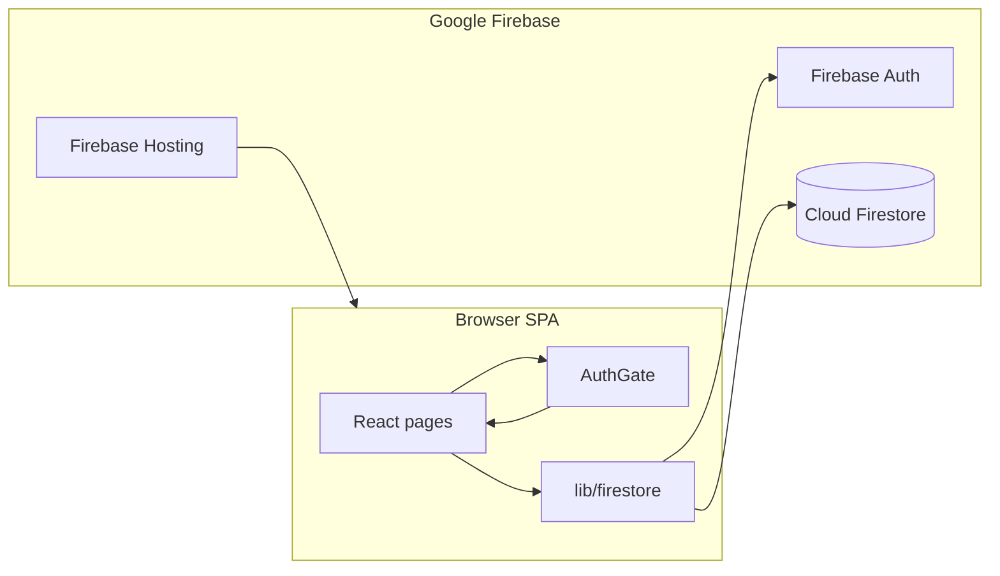

# Event Admin Dashboard

A **read-heavy admin web app** for operators to inspect and analyse data from the same **Cloud Firestore** and **Firebase Authentication** used by the mobile app (Flutter). This repo contains only the **React (Vite + TypeScript)** SPA and **Firebase configuration** (Hosting, Firestore rules, composite indexes). It does **not** contain the mobile app.

---

## What you get

| Area        | Purpose |
|------------|---------|
| Dashboard  | High-level stats and charts (cached where possible). |
| Events     | List, filter, quick view; link to per-event detail and funnels. |
| Users      | Paginated directory; detail page with attended events and payments. |
| Payments   | Payment list and aggregates. |
| Messages   | Chat activity per event (message counts, organiser context). |
| Analytics  | Category/mode breakdowns, organiser board, geo map (where data exists). |

All data comes from **Firestore queries** and optional **`_admin/*`** cache documents. There is **no custom backend API** in this repo—the browser talks to Firebase directly using the Firebase JS SDK.

---

## Architecture (high level)



1. **`firebase.ts`** — Initializes the Firebase app from **`VITE_*` env vars** (see below).
2. **`AuthGate`** — Wraps the app. After sign-in, if `VITE_ENFORCE_ADMIN_CLAIM=true`, the user must have JWT custom claim **`admin: true`**. Otherwise Firestore security rules will block reads anyway for non-admin users.
3. **`lib/firestore/`** — Firestore access split by domain (`events.ts`, `users.ts`, `payments.ts`, `messages.ts`, `adminCache.ts`, plus `sanitize.ts` / `pagination.ts`); **`lib/firestore/index.ts`** re-exports a single import path (`from '../lib/firestore'`). **`lib/dateUtils.ts`** holds shared chart/date helpers.
4. **Pages** — Route-level UI only; they call `lib/firestore` and render tables/charts.

**Deployed shape:** Vite builds static assets to **`dist/`**. **Firebase Hosting** serves `dist` with SPA fallback (`**` → `index.html`). **Firestore rules** and **indexes** are deployed separately (`firebase deploy`).

---

## Repository layout

```
admin/
├── .env.example          # Template only — copy to .env (never commit .env)
├── firebase.json         # Hosting + Firestore rules/indexes entry points
├── .firebaserc           # Default Firebase project alias
├── firestore.rules       # Security rules (must match Flutter + admin behaviour)
├── firestore.indexes.json # Composite indexes for listed queries
├── index.html
├── package.json
├── vite.config.ts
├── public/               # Static assets (favicon, etc.)
└── src/
    ├── main.tsx          # React root + Router
    ├── App.tsx           # Layout, sidebar, route table
    ├── firebase.ts       # Firebase config from env
    ├── types.ts          # Shared TS types (Event, User, Payment, …)
    ├── components/       # AuthGate, Sidebar, tables, shared UI
    ├── hooks/            # useDebounce, usePagination, useWindowSize
    ├── lib/
    │   ├── firestore/    # Domain modules + index.ts barrel
    │   └── dateUtils.ts # Shared Firestore timestamp + chart bucket helpers
    └── pages/           # Dashboard, Events, EventDetail, Users, UserDetail, …
```

**Rule of thumb:** business logic for “what to query” lives in **`lib/firestore/`**; **pages** focus on state, loading UX, and presentation.

---

## Prerequisites on your machine

- **Node.js** 20+ (LTS recommended).
- **npm** (comes with Node).
- Access to the Firebase project: **Firebase Console** (Auth, Firestore) and, for deploys, **Firebase CLI** logged in (`firebase login`).
- **Git** to clone this repository.

You do **not** need Android Studio or Flutter to run this web app, unless you are also changing the mobile app.

---

## First-time setup (local)

From the repository root (this project folder):

```bash
npm install
```

Create a local env file **from the template** (values are **not** in Git):

```bash
cp .env.example .env
```

Edit **`.env`** and set every **`VITE_*`** variable from your Firebase project:

**Firebase Console** → **Project settings** (gear) → **Your apps** → pick the Web app (or add one) → copy the config into the corresponding `VITE_FIREBASE_*` keys. `VITE_FIREBASE_MEASUREMENT_ID` is optional if Analytics is unused.

Optional, recommended for production-like behaviour:

```env
VITE_ENFORCE_ADMIN_CLAIM=true
```

When this is `true`, only users whose Auth account has custom claim **`admin: true`** can use the UI after login. Claims are set with the **Firebase Admin SDK** (server script, Cloud Function, or Google Cloud environment)—never from the client.

---

## Run during development

```bash
npm run dev
```

Vite starts a dev server (default **http://localhost:5173** unless the port is taken). Open it in a browser, sign in with an admin-capable Firebase Auth user.

**Sign in fails (400 / bad request):** usually wrong email/password or the user has no password set. Fixing that is done in Firebase Auth (reset password or Admin SDK), not in this repo.

**UI loads but everything shows zeros or empty lists:** almost always **Firestore rules** or **missing `admin` custom claim** on the signed-in user. Sign out and sign in again after claims change so the ID token refreshes.

---

## Production build (local verification)

```bash
npm run build
```

Runs TypeScript project references then Vite. Output is **`dist/`**.

Preview the static build locally:

```bash
npm run preview
```

---

## Deploy (Firebase)

### Preferred path: CI-managed deploys

GitHub Actions owns deploys. Any push to `main` triggers:

1. **`.github/workflows/ci.yml`** — `npm ci` → `npm run lint` → `npm test -- --run` → `npm run build`. Runs on every PR *and* every push to `main`; a failure blocks merge.
2. **`.github/workflows/deploy.yml`** — runs only after CI succeeds on `main`. Deploys **rules** first (compilation-gated), then **hosting**. The workflow **never passes `--force`** — the 84 composite indexes remain under manual operator control.

Successful deploys surface in the Actions tab; a failed rules compile stops the pipeline before hosting is touched.

### First-time setup (once per repo)

1. Firebase console → **Project settings** → **Service accounts** → **Generate new private key**. Save the JSON.
2. GitHub → repo → **Settings** → **Secrets and variables** → **Actions** → **New repository secret**:
   - Name: `FIREBASE_SERVICE_ACCOUNT_EVENT_APP`
   - Value: the full JSON contents.
3. In GCP IAM, grant that service account:
   - `Cloud Datastore User`
   - `Firebase Admin SDK Administrator Service Agent`
   - `Firebase Hosting Admin`

**Rotate the service-account key** at least every 90 days: generate a new one, update the GitHub secret, then delete the old key from Firebase console.

### Break-glass manual deploy

Only if CI is broken or you need to deploy from your laptop:

```bash
npm run build
firebase deploy --only firestore:rules,hosting
```

**Never** run `firebase deploy --only firestore:indexes --force` — this wipes all console-managed indexes. If an index needs changing, edit `firestore.indexes.json`, diff with `firebase firestore:indexes`, then deploy with `--only firestore:indexes` (no `--force`).

**Never commit** `.env`, service account JSON files, or private keys—see **`.gitignore`**.

---

## Authentication model (for new developers)

| Concept | Role |
|--------|------|
| Firebase Auth | Identifies the person (email/password in this UI). |
| Custom claim `admin: true` | Carried in the JWT; used by **AuthGate** (when enforced) and by **Firestore rules** for broad read access to admin collections. |
| Firestore `users/{uid}` | Profile data; **not** the same as server-side admin flags unless you add code to use it. |

Granting admin access in **production** should be a deliberate, audited step (Admin SDK or secure Cloud Function), not a client-side toggle.

---

## Relationship to the mobile app

- **Same Firestore database** and **same Auth project** as Flutter.
- Schema assumptions (collection names, field shapes, `DocumentReference` vs string IDs) are implemented in **`lib/firestore/`** with fallbacks where data is inconsistent.
- **Changing Firestore rules** here affects **all clients** immediately after deploy—coordinate with mobile releases when tightening rules.

### Collections the rules cover

`firestore.rules` explicitly allows the following collections. If the mobile app adds a new collection, **add a rule for it first** — the file ends with `match /{document=**} { allow read, write: if false; }`.

| Collection | Who can write | Who can read |
|---|---|---|
| `Event` + `/attendees` + `/chat_messages` | author / admin | signed-in |
| `chat_messages` (top-level 1-to-1 DMs) | sender / admin | signed-in |
| `payment` | signed-in create; admin update/delete | signed-in |
| `users` + `/fcm_tokens` | owner / admin | signed-in |
| `event_category`, `country_code` | admin | public |
| `bookmark` | owner | owner |
| `gallery` | signed-in create; admin edit | public |
| `bank_account`, `payout` | signed-in create; admin edit | signed-in |
| `reports_event` | signed-in create; admin only after | admin |
| `metrics_event` | anyone create (telemetry) | admin |
| `total/**` | admin | signed-in |
| `ff_user_push_notifications` | sender only (verified) | admin |
| `admin` (FF legacy) | signed-in create; admin edit | public |
| `_admin/**` | admin | admin |
| `_admin_audit` | admin create; append-only | admin |
| `_admin_errors` | admin create; append-only | admin |

---

## Ops runbook

### Admin login
- URL: `https://event-app-880a3.web.app` (hosted) or your dev port.
- Account: `admin@eventapp.com` + the fixed password stored in your team password manager.
- The `admin: true` custom claim was set via:
  ```bash
  node scripts/set-admin-claim.mjs admin@eventapp.com
  ```
- **Rotate the password** at least every 90 days through the Firebase Auth console. Never commit the password to git.

### Audit log (`_admin_audit`)

Every destructive admin action (event delete, publish/unpublish, event update, user update) is written to `_admin_audit/{auto-id}` with:

```typescript
{
  type: 'event.delete' | 'event.publish' | 'event.unpublish' | 'event.update' | 'user.update' | ...,
  actor:  { uid, email, name },
  target: { kind: 'event' | 'user', id, name },
  metadata: { changedFields?: string[] },
  createdAt: Timestamp,
  expiresAt: Timestamp,       // createdAt + 90 days
}
```

**Retention: 90 days.** A Firestore TTL policy is configured on the `expiresAt` field — Firestore will scan and delete any doc whose `expiresAt < now()` once per day. TTL deletes bypass security rules so the `allow delete: if false` on the collection still holds.

To **verify the TTL policy** is active:
```bash
TOKEN=$(node -e "console.log(require(require('os').homedir()+'/.config/configstore/firebase-tools.json').tokens.access_token)")
curl -s -H "Authorization: Bearer $TOKEN" \
  "https://firestore.googleapis.com/v1/projects/event-app-880a3/databases/(default)/collectionGroups/_admin_audit/fields/expiresAt"
```
Expected `ttlConfig.state`: `ACTIVE`.

To **(re)create the TTL policy** (e.g., after restoring from backup):
```bash
curl -X PATCH \
  -H "Authorization: Bearer $TOKEN" -H "Content-Type: application/json" \
  "https://firestore.googleapis.com/v1/projects/event-app-880a3/databases/(default)/collectionGroups/_admin_audit/fields/expiresAt?updateMask=ttlConfig" \
  -d '{"ttlConfig":{}}'
```

To **view recent audit entries** from the Firebase console: Firestore → `_admin_audit` → sort by `createdAt` desc. A dedicated in-app viewer page is a good next step if forensic needs grow.

### Error tracking (`_admin_errors`)

Uncaught exceptions thrown inside the admin web app are written to `_admin_errors/{auto-id}` from three entry points:

- **React render errors** — caught by the top-level `ErrorBoundary` (`components/ErrorBoundary.tsx`).
- **Synchronous/script errors** — `window.addEventListener('error', …)` in `main.tsx`.
- **Unhandled promise rejections** — `window.addEventListener('unhandledrejection', …)` in `main.tsx`.

Each document has the shape:

```typescript
{
  message: string,          // truncated to 1 KB
  stack: string,            // truncated to 4 KB
  source: 'boundary' | 'window.error' | 'unhandledrejection' | custom,
  extras: Record<string, unknown>,
  url: string,
  userAgent: string,
  actor: { uid, email, name },
  createdAt: Timestamp,
  expiresAt: Timestamp,     // createdAt + 90 days
}
```

**Retention: 90 days.** A Firestore TTL policy on the `expiresAt` field deletes stale entries. Rules mirror `_admin_audit` — admin-only create/read, no update/delete.

To **verify / (re)create** the TTL policy (first-time setup, or after a restore):

```bash
TOKEN=$(node -e "console.log(require(require('os').homedir()+'/.config/configstore/firebase-tools.json').tokens.access_token)")

curl -s -H "Authorization: Bearer $TOKEN" \
  "https://firestore.googleapis.com/v1/projects/event-app-880a3/databases/(default)/collectionGroups/_admin_errors/fields/expiresAt"

curl -X PATCH \
  -H "Authorization: Bearer $TOKEN" -H "Content-Type: application/json" \
  "https://firestore.googleapis.com/v1/projects/event-app-880a3/databases/(default)/collectionGroups/_admin_errors/fields/expiresAt?updateMask=ttlConfig" \
  -d '{"ttlConfig":{}}'
```

`logClientError` is fire-and-forget — if Firestore is unreachable, it logs a `console.warn` but never throws, so a broken logger can't itself crash the app.

---

## Troubleshooting

| Symptom | Things to check |
|--------|------------------|
| `POST … signInWithPassword … 400` | Wrong credentials; user missing password hash; Auth user deleted. |
| Empty data after login | User lacks `admin: true` claim; rules block reads; sign out/in to refresh token. |
| Firestore “index required” in console | Deploy **`firestore.indexes.json`** or create the suggested index from the error link; wait until index status is **Enabled**. |
| Stale analytics on Dashboard | `_admin` cache TTL; some pages call **refresh** explicitly—see `refreshAnalyticsCache` in **`lib/firestore/adminCache.ts`**. |

---

## Page State Hooks Pattern

Large pages (Events, Payments, Analytics) extract their state management and data fetching logic into custom hooks (`useEventsPage`, `usePaymentsPage`, `useAnalyticsCharts`) to keep the UI layer thin and maintainable.

### Why?
- **Readability:** Pages become focused on rendering, not state logic.
- **Testability:** Hooks can be unit-tested independently without mounting React components.
- **Reusability:** Similar patterns (browse + search + filters) can be reused across pages.

### Example: `useEventsPage`

```typescript
// src/hooks/useEventsPage.ts
export function useEventsPage() {
  const [items, setItems] = useState<Event[]>([]);
  const [page, setPage] = useState(1);
  // ... all state, effects, callbacks
  return {
    items, page, hasMore, loadPage,
    status, setStatus, mode, setMode, search, setSearch,
    searchMode, searchResults, triggerSearch, exitSearchMode,
    selected, setSelected, fetchEventCounts,
    catMap, displayItems,
    togglePublish, handleDelete,
  };
}

// src/pages/Events.tsx
export default function Events() {
  const { items, page, /* ... */ } = useEventsPage();
  // Render tables, modals, filters using hook state
}
```

### Adding a New Page Hook

1. Identify state variables, effects, and callbacks in your page.
2. Create `src/hooks/use[PageName].ts` with:
   - All `useState` declarations
   - All `useEffect` + `useCallback` logic
   - A return interface with all public methods and computed values
3. Import and use the hook in your page; page becomes ~10 KB → ~5 KB.
4. Add unit tests in `src/hooks/use[PageName].test.ts`.

---

## Code style for contributors

- **TypeScript** strict build (`tsc -b` runs in **`npm run build`**).
- **Unit tests:** `npm test` (Vitest) — pure helpers in `lib/` and `lib/firestore/*.test.ts`.
- Prefer **existing hooks** and **table/layout components** for consistency.
- **New page state:** extract into a custom hook (see **Page State Hooks Pattern** above).
- New Firestore queries: add **indexes** if Firestore asks for composite indexes; update **`firestore.indexes.json`** and deploy.

For questions about **product scope** or **Firestore field meanings**, refer to your team’s schema documentation or the Flutter app models—this README describes only how **this** admin UI is structured and run.
