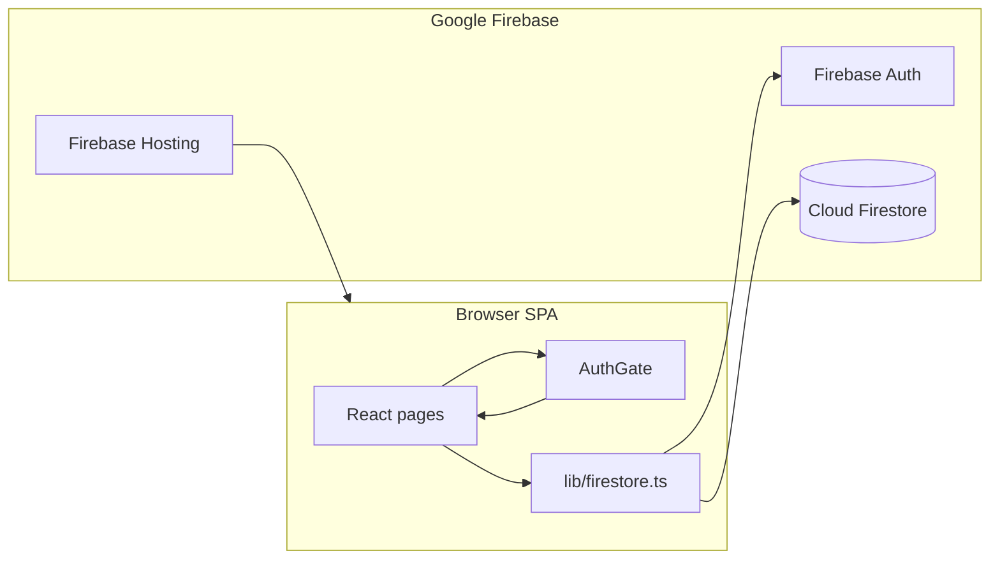

# Event Admin Dashboard

A **read-heavy admin web app** for operators to inspect and analyse data from the same **Cloud Firestore** and **Firebase Authentication** used by the mobile app (Flutter). This repo contains only the **React (Vite + TypeScript)** SPA and **Firebase configuration** (Hosting, Firestore rules, composite indexes). It does **not** contain the mobile app.

---

## What you get

| Area        | Purpose |
|------------|---------|
| Dashboard  | High-level stats and charts (cached where possible). |
| Events     | List, filter, quick view; link to per-event detail and funnels. |
| Users      | Paginated directory; detail page with attended events and payments. |
| Payments   | Payment list and aggregates. |
| Messages   | Chat activity per event (message counts, organiser context). |
| Analytics  | Category/mode breakdowns, organiser board, geo map (where data exists). |

All data comes from **Firestore queries** and optional **`_admin/*`** cache documents. There is **no custom backend API** in this repo—the browser talks to Firebase directly using the Firebase JS SDK.

---

## Architecture (high level)



1. **`firebase.ts`** — Initializes the Firebase app from **`VITE_*` env vars** (see below).
2. **`AuthGate`** — Wraps the app. After sign-in, if `VITE_ENFORCE_ADMIN_CLAIM=true`, the user must have JWT custom claim **`admin: true`**. Otherwise Firestore security rules will block reads anyway for non-admin users.
3. **`lib/firestore.ts`** — Central place for Firestore access: pagination, aggregations, category maps, batch name resolution, analytics cache helpers. **New screens should extend patterns here** rather than duplicating queries ad hoc in pages.
4. **Pages** — Route-level UI only; they call `lib/firestore.ts` and render tables/charts.

**Deployed shape:** Vite builds static assets to **`dist/`**. **Firebase Hosting** serves `dist` with SPA fallback (`**` → `index.html`). **Firestore rules** and **indexes** are deployed separately (`firebase deploy`).

---

## Repository layout

```
admin/
├── .env.example          # Template only — copy to .env (never commit .env)
├── firebase.json         # Hosting + Firestore rules/indexes entry points
├── .firebaserc           # Default Firebase project alias
├── firestore.rules       # Security rules (must match Flutter + admin behaviour)
├── firestore.indexes.json # Composite indexes for listed queries
├── index.html
├── package.json
├── vite.config.ts
├── public/               # Static assets (favicon, etc.)
└── src/
    ├── main.tsx          # React root + Router
    ├── App.tsx           # Layout, sidebar, route table
    ├── firebase.ts       # Firebase config from env
    ├── types.ts          # Shared TS types (Event, User, Payment, …)
    ├── components/       # AuthGate, Sidebar, tables, shared UI
    ├── hooks/            # useDebounce, usePagination, useWindowSize
    ├── lib/
    │   └── firestore.ts  # All Firestore reads/writes used by the admin UI
    └── pages/           # Dashboard, Events, EventDetail, Users, UserDetail, …
```

**Rule of thumb:** business logic for “what to query” lives in **`lib/firestore.ts`**; **pages** focus on state, loading UX, and presentation.

---

## Prerequisites on your machine

- **Node.js** 20+ (LTS recommended).
- **npm** (comes with Node).
- Access to the Firebase project: **Firebase Console** (Auth, Firestore) and, for deploys, **Firebase CLI** logged in (`firebase login`).
- **Git** to clone this repository.

You do **not** need Android Studio or Flutter to run this web app, unless you are also changing the mobile app.

---

## First-time setup (local)

From the repository root (this project folder):

```bash
npm install
```

Create a local env file **from the template** (values are **not** in Git):

```bash
cp .env.example .env
```

Edit **`.env`** and set every **`VITE_*`** variable from your Firebase project:

**Firebase Console** → **Project settings** (gear) → **Your apps** → pick the Web app (or add one) → copy the config into the corresponding `VITE_FIREBASE_*` keys. `VITE_FIREBASE_MEASUREMENT_ID` is optional if Analytics is unused.

Optional, recommended for production-like behaviour:

```env
VITE_ENFORCE_ADMIN_CLAIM=true
```

When this is `true`, only users whose Auth account has custom claim **`admin: true`** can use the UI after login. Claims are set with the **Firebase Admin SDK** (server script, Cloud Function, or Google Cloud environment)—never from the client.

---

## Run during development

```bash
npm run dev
```

Vite starts a dev server (default **http://localhost:5173** unless the port is taken). Open it in a browser, sign in with an admin-capable Firebase Auth user.

**Sign in fails (400 / bad request):** usually wrong email/password or the user has no password set. Fixing that is done in Firebase Auth (reset password or Admin SDK), not in this repo.

**UI loads but everything shows zeros or empty lists:** almost always **Firestore rules** or **missing `admin` custom claim** on the signed-in user. Sign out and sign in again after claims change so the ID token refreshes.

---

## Production build (local verification)

```bash
npm run build
```

Runs TypeScript project references then Vite. Output is **`dist/`**.

Preview the static build locally:

```bash
npm run preview
```

---

## Deploy (Firebase)

Ensure the CLI targets the right project (`firebase use` / `.firebaserc`).

Typical full deploy for this app:

```bash
npm run build
firebase deploy --only firestore:rules,firestore:indexes,hosting
```

- **`firestore:rules`** — Live rules; must stay compatible with the Flutter app.
- **`firestore:indexes`** — Composite indexes; first-time index builds can take minutes in the console.
- **`hosting`** — Uploads **`dist/`** after you build.

The **`deploy`** script in **`package.json`** runs build + hosting only; add rules/indexes when you change them.

**Never commit** `.env`, service account JSON files, or private keys—see **`.gitignore`**.

---

## Authentication model (for new developers)

| Concept | Role |
|--------|------|
| Firebase Auth | Identifies the person (email/password in this UI). |
| Custom claim `admin: true` | Carried in the JWT; used by **AuthGate** (when enforced) and by **Firestore rules** for broad read access to admin collections. |
| Firestore `users/{uid}` | Profile data; **not** the same as server-side admin flags unless you add code to use it. |

Granting admin access in **production** should be a deliberate, audited step (Admin SDK or secure Cloud Function), not a client-side toggle.

---

## Relationship to the mobile app

- **Same Firestore database** and **same Auth project** as Flutter.
- Schema assumptions (collection names, field shapes, `DocumentReference` vs string IDs) are implemented in **`lib/firestore.ts`** with fallbacks where data is inconsistent.
- **Changing Firestore rules** here affects **all clients** immediately after deploy—coordinate with mobile releases when tightening rules.

---

## Troubleshooting

| Symptom | Things to check |
|--------|------------------|
| `POST … signInWithPassword … 400` | Wrong credentials; user missing password hash; Auth user deleted. |
| Empty data after login | User lacks `admin: true` claim; rules block reads; sign out/in to refresh token. |
| Firestore “index required” in console | Deploy **`firestore.indexes.json`** or create the suggested index from the error link; wait until index status is **Enabled**. |
| Stale analytics on Dashboard | `_admin` cache TTL; some pages call **refresh** explicitly—see `refreshAnalyticsCache` in **`lib/firestore.ts`**. |

---

## Code style for contributors

- **TypeScript** strict build (`tsc -b` runs in **`npm run build`**).
- Prefer **existing hooks** and **table/layout components** for consistency.
- New Firestore queries: add **indexes** if Firestore asks for composite indexes; update **`firestore.indexes.json`** and deploy.

For questions about **product scope** or **Firestore field meanings**, refer to your team’s schema documentation or the Flutter app models—this README describes only how **this** admin UI is structured and run.
